# qview

> 用 Rust 写的高性能日志 / 文本浏览器。**打开 52.7 GB（5 亿行）日志毫秒级、系统内存与文件大小无关、命中精确计数且结果可任意跳转。**

[](https://www.rust-lang.org/)
[](Cargo.toml)
[](LICENSE)
[](#多前端)

作者：qinwh · [qinwh.cn](https://qinwh.cn)

> ⚠️ **前端成熟度**：当前 **`qview-gui-egui`（跨平台 GUI）是唯一功能完整、持续迭代的主推前端**，请优先选用。Windows 原生 / macOS 原生 / TUI 均处于**基础可用、特性持续补齐**阶段——浏览、搜索、主题等核心能力可用，但相对 egui 仍有部分功能缺口（如编辑、AI 器灵）；**TUI 尚未做超大文件的打开优化**（50 GB 级文件首屏较慢），主要面向服务器 / SSH 等无图形环境。日常使用与性能数据请以 egui 版为准。

---

## 目录

- [项目简介](#项目简介)
- [界面截图](#界面截图)
- [核心特性](#核心特性)
- [性能实测](#性能实测)
- [多前端](#多前端)
- [快速开始](#快速开始)
- [使用指南](#使用指南)
- [架构设计](#架构设计)
- [配置](#配置)
- [项目结构](#项目结构)
- [测试](#测试)
- [标准性能基准](#标准性能基准)
- [打包发布（Windows 安装向导）](#打包发布windows-安装向导)
- [文档](#文档)
- [路线图](#路线图)
- [License](#license)

---

## 项目简介

qview 是一个定位为"**超大文本文件随便查看**"的高性能浏览器：

- **浏览走 mmap**——按需分页、零拷贝，只有你看到的页才进物理内存；
- **索引与搜索走流式扫描**——Windows 上以 `FILE_FLAG_NO_BUFFERING` 直接 DMA 读入、绕过系统文件缓存、读完即弃，**系统内存占用与文件大小无关**（GB 乃至 TB 级文件也只占 ~两个 64 MB 扫描窗口）；
- **索引单遍贴满磁盘**，二次打开走 `.qli` 缓存；
- **搜索总数永远精确、导航内存有界**。

引擎（`qview-core`）UI 无关，上层提供 **4 个前端**：功能最全的 egui 图形界面、vim 键位的终端界面、极轻量的 Windows 原生界面与 macOS 原生界面，全部共用同一套引擎与配置模型。

---

## 界面截图

> 除特别标注外都是 **egui GUI** 的效果。

### ① 主界面 · 大文件浏览

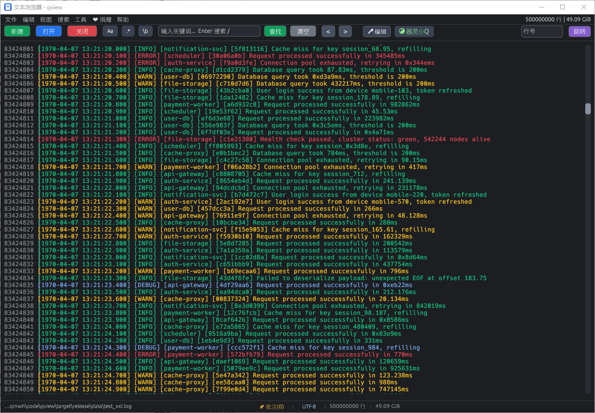


### ② 搜索高亮 + 精确计数

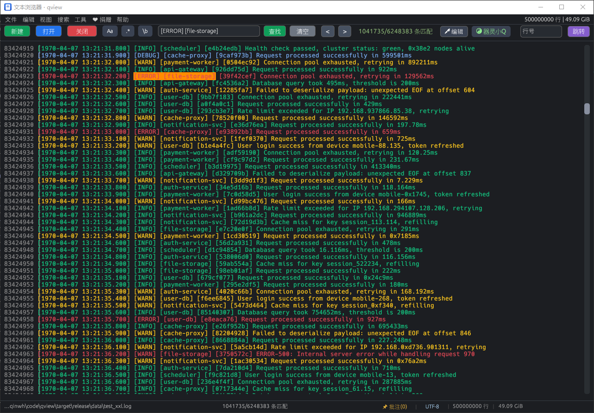


### ③ macOS 主界面

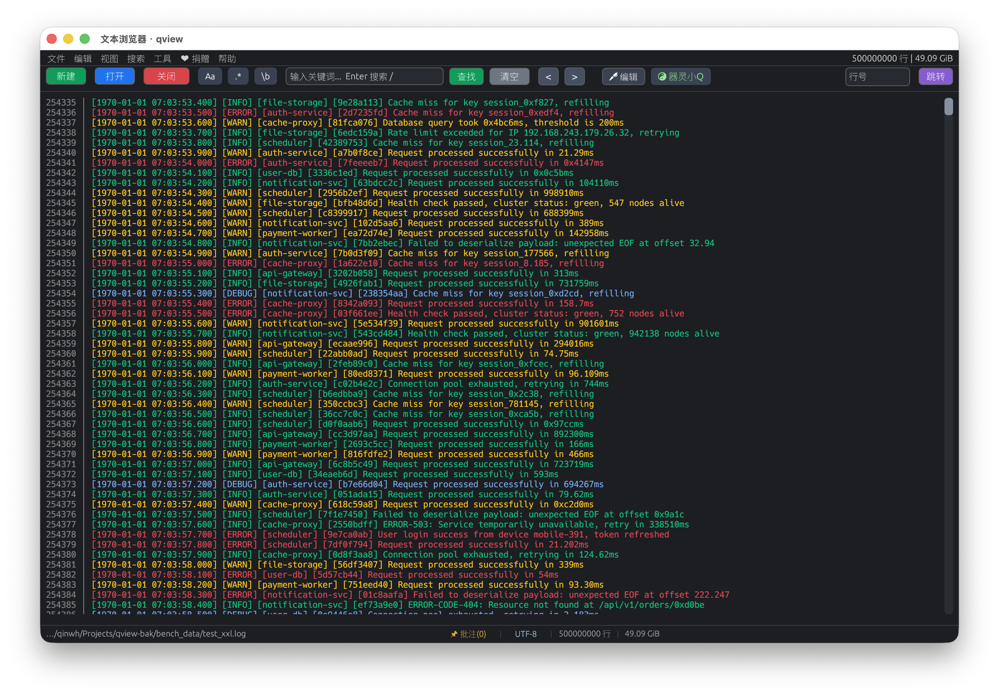


### ④ 超长行自动换行

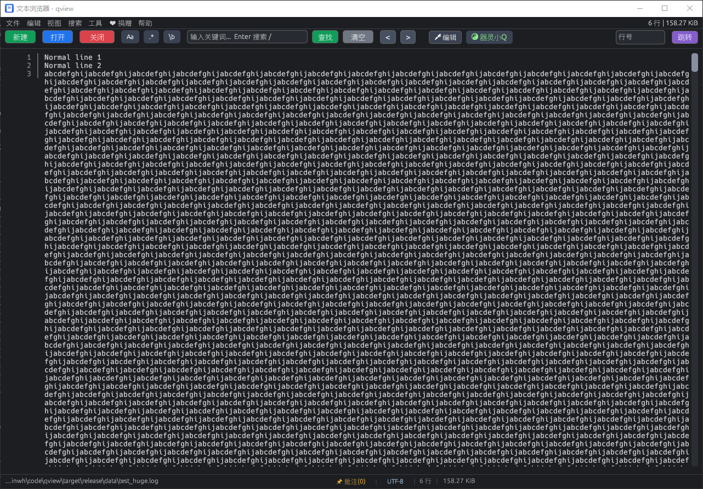


### ⑤ AI 器灵小Q · 对话分析

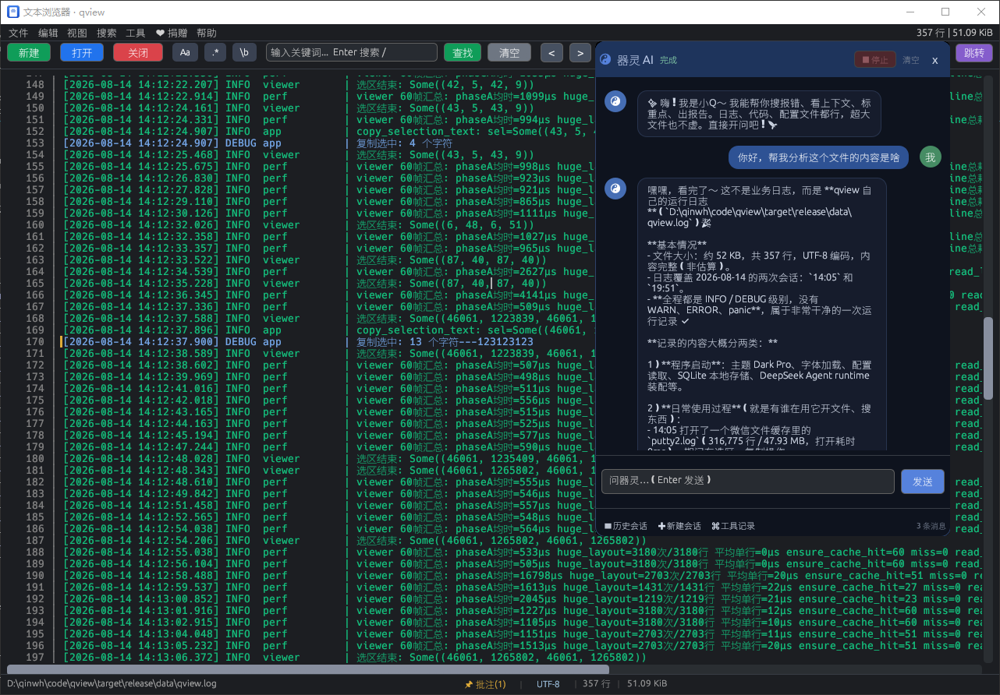


### ⑥ 编辑模式

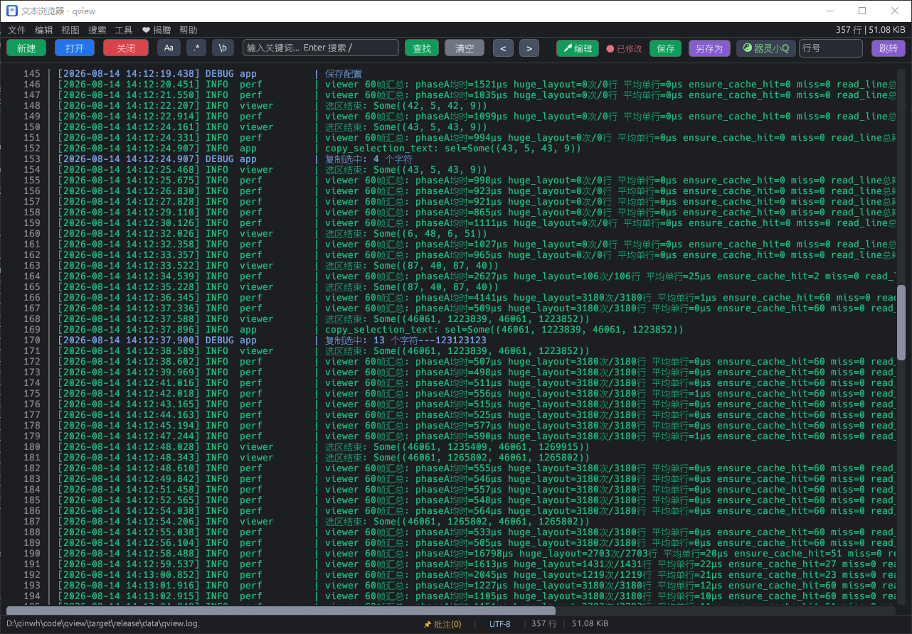


### ⑦ 批注系统

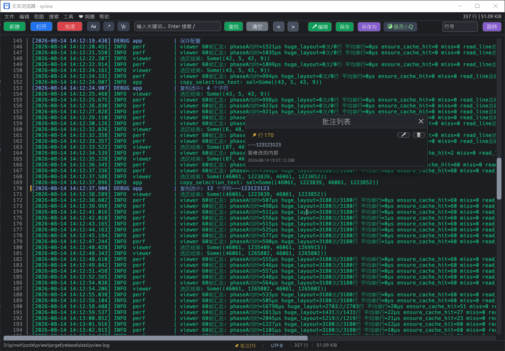


### ⑧ 主题切换

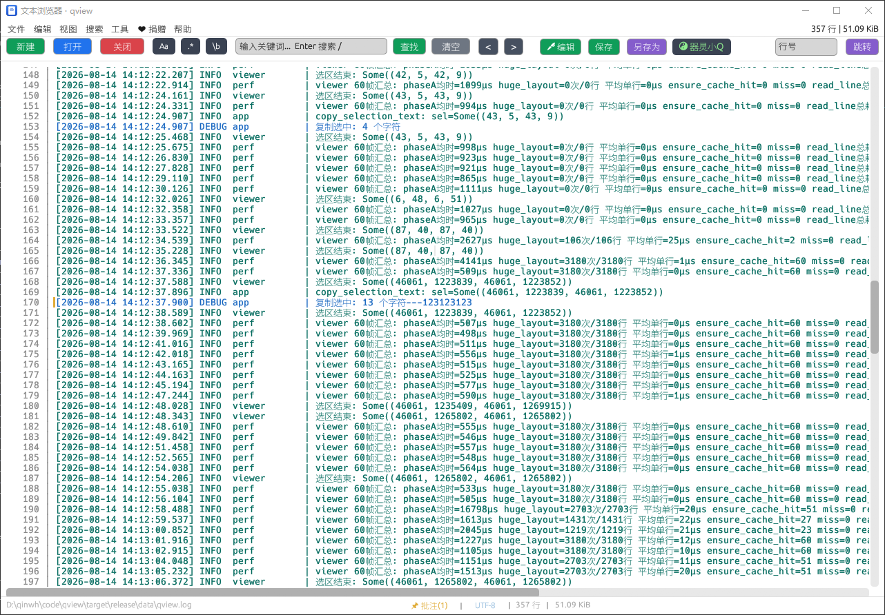


### ⑨ Windows 安装向导

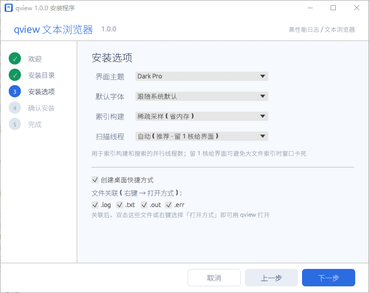


### ⑩ TUI 终端界面

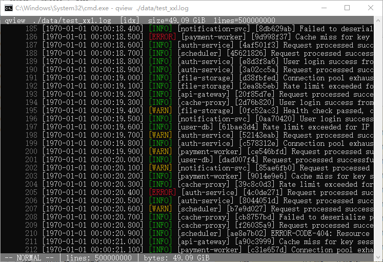


### ⑪ Windows 原生前端

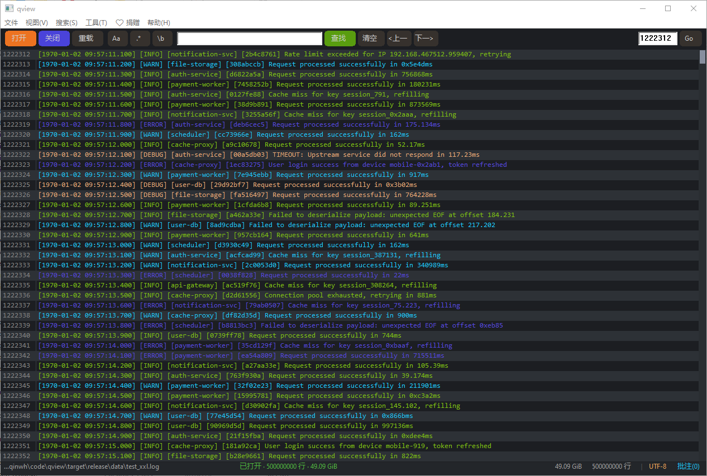


---

## 核心特性

**浏览**
- mmap 内存映射，大文件秒开、滚动不卡；LRU 行缓存只保留可视区附近解码文本
- 虚拟滚动 + 自动换行（逐字符断行，CJK 正确）+ 双向自定义滚动条
- 日志级别着色（`[ERROR]` / `[WARN]` / `[INFO]` / `[DEBUG]` …）、行号、空白字符、缩进参考线
- 文本选择（跨行、自动滚边）、右键复制 / 加批注（`类似其它软件的书签功能`）

**搜索**
- 字面量（`memchr` SIMD）与正则（`regex` crate，自动机实现，**无灾难性回溯**）双引擎
- 大小写敏感 / 整词 / 多行查询；CRLF 文件自动按行尾归一化（正则 `$` 自动改写）
- **命中总数始终精确**；结果集大时按间隔采样存储位置，导航任意跳转，内存有界
- 全文件单遍扫描，后台执行不卡 UI，可随时取消；分块扫描对齐真实行首（`^` 锚点与连串模式计数精确）

**编辑**
- 内存内编辑（mmap 只读，修改不落盘直到保存），撤销 / 重做 1024 步
- 连续输入合并为一个撤销步；拆分 / 合并 / 粘贴 / 选区替换作为原子批量操作
- 保存写回原文件（首次自动备份 `.bak`）、另存为、**新建文件**（Ctrl+N 直接进编辑模式）
- 超大文件（> 256 MiB）禁止原位写回，自动引导到另存为

**批注**
- 选中任意内容加批注（附选中内容快照），集中存储于一个 JSON 文件，按文件路径隔离
- 批注列表：跳转 / 编辑 / 删除；编辑保存后按快照**自动重锚定**到新位置，找不到则标记失效

**编码**
- UTF-8 默认，支持 GBK / GB18030 / GB2312 / Big5 / Shift_JIS / EUC-JP / EUC-KR / windows-1252 / UTF-16LE / UTF-16BE
- 状态栏一键切换编码并重新加载（搜索按原始字节进行，见 [REGEX_TEST.md](docs/REGEX_TEST.md) §4.12）

**工程化**
- 后台任务模型：索引 / 搜索 / 保存全部异步提交、轮询进度、可取消，UI 永不阻塞
- 索引缓存 `.qli`：集中目录、xxhash 命名，size/mtime/inode 三重校验自动失效
- 6 套内置主题 + `assets/themes/` 自定义 JSON 主题；中文字体编译期内嵌，运行时零资源文件
- 最近文件 / 搜索历史 / 窗口状态持久化；JSON 配置自动迁移
- 崩溃安全：批注存储写入采用"临时文件 + 原子改名"，崩溃不会截断数据

---

## 性能实测

> 完整数据与对比见 [docs/PERF_REPORT.md](docs/PERF_REPORT.md)。
> 实测环境：Apple M4 · 24 GB · macOS 26.3.1 · v1.0.0。

| 操作 | 实测 |
|------|------|
| 打开 52.7 GB / 5 亿行 | **4 ms**（与文件大小无关） |
| 首次建索引 | **15.2 s（≈ 3.47 GB/s，贴磁盘上限）** |
| 全文件正则搜索（5 亿行） | **15.3 s**，命中 **5,107,228** 精确计数 |
| 二次打开（`.qli` 命中） | **2 ms**（5000 万行 → 缓存 30 MiB，文件 0.06%） |
| 命中结果间跳转 | **0.04 µs / 次**（与结果集大小几乎无关） |
| 系统内存随文件大小增长 | **否**（10 MiB → 50 GB，引擎 RSS 仅 200 → 314 MB） |

三档壳子对比：engine / TUI / GUI 共用同一个引擎，**UI 层只增加 ~5 MB（峰值 RSS 跨 50 GB 文件不变）**。GUI 固定多 ~120 MB 用于 OpenGL + egui font atlas + tokio runtime，与文件大小无关。

---

## 多前端

| 前端 | 说明 | 空载占用 |
|------|------|---------|
| `qview-gui-egui` | **跨平台 GUI（egui + glow），功能最全**：图形界面、主题、批注、完整编辑 | ~100 MiB |
| `qview`（TUI） | 终端界面（ratatui + crossterm），vim 键位，`tail -f` | ~1 MiB |
| `qview-gui-native` | Windows 原生 Win32 / GDI，免框架、功能对标 egui（主题 / 搜索 / 批注 / 设置） | ~12 MiB |
| `qview-gui-macos` | macOS 原生 AppKit / CoreText，极简 | — |

三个 GUI 前端共享同一个 `qview-core` 引擎；TUI 同样直接消费引擎。egui GUI 是当前主推版本（唯一带安装包发布的前端）。Windows 原生版为对标 egui 的轻量实现：6 套主题、精确搜索高亮与视口锚定跳转、文本选择/复制/批注、word wrap、空白字符与缩进参考线渲染、编码切换、设置/缓存管理/批注对话框、拖拽打开，空载仍 ~12 MiB。

---

## 快速开始

**环境要求**：Rust 1.75+，支持 Windows / macOS / Linux。四个前端共用同一套引擎，挑一个够用的即可。

### 直接运行（开发 / 临时用）

```bash
# egui GUI（主推，功能最全）—— Windows / macOS / Linux 通用
cargo run --release -p qview-gui-egui -- path/to/your.log

# TUI（终端，vim 键位）—— 任何有终端的环境
cargo run --release -p qview -- path/to/your.log

# Windows 原生（极轻量，Win32/GDI）—— 仅 Windows
cargo run --release -p qview-gui-native -- path/to/your.log

# macOS 原生（极简，AppKit）—— 仅 macOS
cargo run --release -p qview-gui-macos -- path/to/your.log
```

### 打包发布（按平台挑）

**Windows**

| 目标 | 命令 | 产物 |
|------|------|------|
| **安装向导（推荐）** | `cargo run --release -p qview-installer --bin qview-bundle` | `target/release/qview-setup-<version>.exe` |
| egui 绿色版 | `cargo build --release -p qview-gui-egui` | `target/release/qview-gui-egui.exe`（需连同旁边 `assets/` 一起分发）|
| Windows 原生 | `cargo build --release -p qview-gui-native` | `target/release/qview-gui-native.exe`（单文件、用系统字体、拷走即用）|

> 安装向导是 egui 的正式发布方式：一条命令产出自包含安装包，装完带字体/图标、`.log/.txt/.out/.err` 文件关联、桌面快捷方式、卸载器。绿色版 exe **不含资源**，`assets/` 目录（字体/图标/主题）必须和 exe 放一起，否则字体图标缺失；Windows 原生版无此问题。

**macOS**

打包脚本会先 `cargo build --release`，再把 release 二进制组装成 `target/qview.app`（Finder 双击直接启动，不弹 Terminal「小黑框」），并做 ad-hoc 签名供本机运行。**请在仓库根目录执行**——脚本按相对路径定位工作区根。

```bash
# egui 版（主推）→ target/qview.app
./frontends/gui-egui/scripts/package.sh

# macOS 原生版 → target/qview.app
./frontends/gui-macos/scripts/package.sh

# 已构建过、只重新打包（跳过 cargo build）
./frontends/gui-egui/scripts/package.sh --no-build
```

首次运行若提示 `permission denied`，先给脚本加执行权限（只需一次）：

```bash
chmod +x frontends/gui-egui/scripts/package.sh frontends/gui-macos/scripts/package.sh
```

运行 / 安装：

```bash
open target/qview.app                                  # Finder 方式启动
target/qview.app/Contents/MacOS/qview-gui-egui 文件     # 命令行方式（可看 stdout/stderr）
cp -R target/qview.app /Applications/                  # 安装到「应用程序」
```

> ⚠️ 两个脚本都输出 `target/qview.app`，后跑者覆盖前者；想同时保留，跑完先把 `target/qview.app` 改名。
> `.app` 为 ad-hoc 签名，仅保证本机运行；要分发给别人需改用 Developer ID 签名，否则首次打开会触发 Gatekeeper（右键 → 打开 → 仍要打开）。
> 不想打包也可以直接 `cargo run --release -p qview-gui-egui -- 文件` 跑裸二进制（Finder 双击会弹 Terminal 承载日志输出）。

**Linux**

目前没有安装包 / `.app`，构建裸二进制即可：

```bash
cargo build --release -p qview            # TUI → target/release/qview
cargo build --release -p qview-gui-egui   # egui GUI 也能跑 → 单二进制（字体/图标已内嵌）
```

### 构建整个工作区

每个前端只能在自己平台编译（native = Win32、macos = AppKit、installer = Windows 注册表），全量构建需 exclude 其它平台的 crate：

```bash
# Windows
cargo build --release --exclude qview-gui-macos
# macOS
cargo build --release --exclude qview-installer --exclude qview-gui-native
# Linux
cargo build --release --exclude qview-installer --exclude qview-gui-native --exclude qview-gui-macos
```

生成测试日志（可选）：

```bash
python tests/gen_test_log.py --lines 1000000 --out test.log
python tests/gen_regex_test.py          # 正则搜索对账数据 + 期望命中表
```

---

## 使用指南

### GUI（egui）

启动后：**打开** 或 **新建** 或直接把文件拖进窗口。

**快捷键一览**

| 快捷键 | 作用 | 快捷键 | 作用 |
|--------|------|--------|------|
| `Ctrl+N` | 新建文件 | `Ctrl+Shift+S` | 另存为 |
| `Ctrl+O` | 打开文件 | `Ctrl+R` | 重新加载 |
| `Ctrl+S` | 保存（编辑模式） | `Ctrl+Z` / `Ctrl+Y` | 撤销 / 重做 |
| `Ctrl+F` | 聚焦搜索框 | `Ctrl+L` | 聚焦跳转行号 |
| `Enter` | 搜索 / Shift+Enter 换行 | `F3` / `Ctrl+G` | 下一个匹配（Shift=上一个） |
| `Ctrl+I` | 文件属性 | `F1` | 使用说明 |
| `Ctrl+`+ / `-` / `0` | 字体放大 / 缩小 / 重置 | `Ctrl+Shift+T` | 循环切换主题 |
| `Home` / `End` | 顶部 / 底部 | `PgUp` / `PgDn` | 上 / 下翻页 |

**搜索**：工具栏输入关键词，`Enter` 执行；`Aa`（大小写）、`.*`（正则）、`\b`（整词）三个开关点击即切换，命中总数实时显示在状态栏；正则结果集再大跳转也不卡。

**编辑**：工具栏「🖊 编辑」开启编辑模式，光标、方向键、输入 / 粘贴 / 退格 / 删除 / 回车换行 / Tab 缩进；工具栏出现「保存 / 另存为」。新建文件（Ctrl+N）会自动进入编辑模式。

**批注**：选中内容后右键「📝 添加批注」；状态栏「📌 批注(N)」打开批注列表（跳转 / 编辑 / 删除）。未保存的新文件暂不能加批注（右键该项置灰并有提示）。

**查看**：菜单「视图」切换行号 / 自动换行 / 空白字符 / 缩进参考线 / 级别着色；「设置 → 主题」即时切换 6 套主题。

**编码**：状态栏右侧点编码标签弹出列表切换（UTF-8 / GBK / Big5 …），切换后自动以新编码重载。

### TUI（终端）

vim 风格：`j/k` 上下移、`/` 搜索、`n/N` 下一个 / 上一个、`:` 命令（`:1234` 跳行、`:w` 保存、`:s/old/new/g` 替换、`:q` 退出）、`dd/p/yy/u` 行内编辑、`v` 可视模式、`F` 或 `--follow` 开启 `tail -f`。

```bash
qview --follow app.log        # tail -f
qview --no-index app.log      # 不读写 .qli 缓存
qview --sync-index app.log    # 前台同步建索引
qview --config cfg.toml x.log # 指定 TOML 配置
```

---

## 架构设计

### 分层

```
┌────────────────────────────────────────────────────────────────┐
│  前端层：qview-gui-egui · qview（TUI）· gui-native · gui-macos │
│  （渲染、输入、对话框；只消费引擎 API，不触碰引擎内部）        │
├────────────────────────────────────────────────────────────────┤
│  qview-core（UI 无关引擎）                                     │
│  engine.rs     统一入口：打开 / 索引 / 搜索 / 编辑 / 保存      │
│  file/         mmap 后端 · 稀疏行索引 · .qli 持久化 · 流式扫描 │
│                · 后台索引器 · 文件监控                         │
│  search/       字面量(memmem) + 正则(bytes) · BlockIndex 采样  │
│                · 后台搜索 · 分块行首对齐扫描                   │
│  cache/        LRU 行缓存 + 页面缓存                           │
│  edit/         编辑缓冲(插入/替换/删除) · 撤销重做 · 写回      │
│                · 后台保存                                      │
│  annotation/   批注模型 + 集中 JSON 存储 + 重锚定              │
│  config.rs     EngineConfig（各前端共用）                      │
│  parallel.rs   共享扫描线程池                                  │
└────────────────────────────────────────────────────────────────┘
```

### 设计原则

1. **读两种路径，各司其职**
   - **浏览**：整文件 mmap，按需分页、零拷贝、随机访问；
   - **索引 / 搜索**：流式窗口扫描（`WindowStream`），Windows 用 `FILE_FLAG_NO_BUFFERING` 绕过系统文件缓存，读完即弃——所以**系统内存与文件大小无关**。
2. **单遍贴满磁盘**：索引与搜索都是单遍扫描（`memchr` SIMD 数换行 / 匹配 + rayon 并行分块 + 专用读线程双缓冲重叠），吞吐贴着磁盘上限（本机实测 52.7 GB / 15.2 s ≈ 3.23 GiB/s）。
3. **精确总数 + 有界内存**：搜索命中少时全存、命中多时按间隔采样，**总数始终精确**；跳转靠采样点二分 + 稀疏索引行定位，与结果集大小几乎无关（实测 20–56 µs/次）。
4. **永远不占满 CPU**：扫描池始终留 1 核给 UI 与读线程——实测占满所有核反而因读线程被抢占、磁盘空转而更慢。
5. **一切后台可取消**：索引 / 搜索 / 保存都走 `submit → poll → cancel`，UI 永不阻塞，切换文件或发起新任务立即停掉旧扫描。
6. **编辑不落盘直到保存**：mmap 只读，所有修改在 `EditBuffer`（插入块 / 替换 / 删除）里，保存时流式写回 + 原子改名 + `.bak` 备份。
7. **调参永不失效缓存**：扫描窗口只决定"怎么读"不决定"读到什么"，索引 / 搜索结果与窗口无关，调窗口无需重建 `.qli`。

---

## 配置

所有前端共用 `EngineConfig`（`crates/core/src/config.rs`）；配置序列化在前端本地，字段用 `#[serde(default)]` 保证向前兼容。

### GUI（JSON）

配置文件在程序数据目录：`{程序目录}/data/config.json`。结构为 `gui`（显示 / 主题 / 字体 / 搜索选项）、`engine`（引擎参数）、顶层（最近文件、搜索历史）三组；旧 flat 格式首次加载自动迁移。

```json
{
  "version": "1.0.0",
  "gui":   { "theme": "Dark Pro", "font_size": 13.0, "word_wrap": false },
  "engine": {
    "small_file_threshold": 10485760,
    "line_cache_capacity": 10000,
    "encoding": "UTF-8",
    "index_cache_enabled": true,
    "index_build_mode": "sparse",
    "scan_window_mb": 64,
    "scan_threads": 0,
    "search": { "sample_interval": 100, "max_samples": 10000000 }
  },
  "recent_files": [],
  "search_history": []
}
```

常用引擎参数：

| 参数 | 默认 | 说明 |
|------|------|------|
| `small_file_threshold` | 10 MiB | 小于此值同步内存索引、不写磁盘缓存 |
| `index_build_mode` | `sparse` | 稀疏采样（省内存）/ 全量偏移（省 CPU） |
| `scan_window_mb` | 64 | 流式扫描窗口（16–256），只影响读取方式，不影响结果 |
| `scan_threads` | 0 | 0 = 自动（核数−1，留 1 核给 UI） |
| `search.sample_interval` | 100 | 每 N 个命中存 1 个采样点 |
| `search.max_samples` | 10M | 采样点硬上限（×8 字节 ≈ 80 MB） |

GUI 的「设置 → 引擎」提供图形化配置与「性能预设」（省内存 / 均衡 / 高性能）一键组合。

### TUI（TOML）

```bash
# Linux/macOS: ~/.config/qview/config.toml   Windows: %APPDATA%\qview\config.toml
# 或显式指定：qview --config /path/to/config.toml log.txt
```

```toml
small_file_threshold = 10485760
line_cache_capacity  = 10000
encoding             = "UTF-8"

[search]
sample_interval = 100
max_samples     = 10000000
```

---

## 项目结构

```
qview/
├── Cargo.toml              # workspace 根配置（版本 / profile 单一来源）
├── crates/                 # 库（被复用，不直接产出可执行文件）
│   ├── core/               # 引擎（UI 无关）
│   │   ├── src/
│   │   │   ├── engine.rs       # 统一入口
│   │   │   ├── file/           # mmap · 行索引 · .qli 持久化 · 流式扫描 · 监控
│   │   │   ├── search/         # 字面量 + 正则 · BlockIndex · 后台搜索
│   │   │   ├── cache/          # LRU 行缓存 · 页面缓存
│   │   │   ├── edit/           # 编辑缓冲 · 撤销重做 · 后台保存 · 写回
│   │   │   ├── annotation/     # 批注模型 + 集中存储 + 重锚定
│   │   │   ├── config.rs       # EngineConfig
│   │   │   └── parallel.rs     # 共享扫描线程池
│   │   └── tests/              # 集成测试（编辑 / 索引 / 搜索 / 分块边界）
│   ├── application/        # 引擎能力的工具化封装（agent 工具层）
│   ├── agent/              # AI runtime（contexa ReActWorker + 事件流）
│   ├── store/              # redb 持久化（会话 / 文件元数据 / 历史）
│   └── mcp/                # MCP 协议桥接（暂时从默认构建摘出）
├── frontends/              # 4 个可执行前端
│   ├── cli/                # TUI（ratatui + crossterm），vim 键位
│   │   ├── src/app|tui/    # 应用状态 / 渲染 / 输入 / 高亮
│   │   └── tests/          # 冒烟 + 编辑集成测试
│   ├── gui-egui/           # 跨平台 GUI（egui + glow），功能最全
│   │   ├── src/            # app · viewer · editor · 菜单 · 工具栏 · 对话框
│   │   ├── assets/         # 字体 / 主题 / 图标 / 作者捐赠收款码
│   │   └── docs/           # GUI 开发文档
│   ├── gui-native/         # Windows 原生 Win32 / GDI
│   └── gui-macos/          # macOS 原生 AppKit
├── dist/installer/         # Windows 分发：安装向导 + 卸载器 + 一键打包工具
├── bench/                  # 可复现行业性能基准（qview-bench）
├── tests/                  # 测试日志生成脚本（gen_test_log.py / gen_regex_test.py）
└── docs/
    ├── PERF_REPORT.md      # 性能分析报告（实测数据与原理）
    ├── BENCHMARK.md        # 基准测试方法论
    ├── REGEX_TEST.md       # 正则搜索测试指南 + 期望命中对照表
    ├── INSTALLER.md        # 安装包构建说明
```

---

## 测试

```bash
cargo test -p qview-core       # 引擎核心（38 项：编辑 / 索引 / 搜索 / 分块边界 / 批注）
cargo test -p qview            # TUI
cargo test -p qview-gui-egui   # GUI（配置解析等）
cargo test -p qview-installer  # 安装器（qpak 往返 / 配置生成）
cargo test -p qview-bench      # 基准
cargo test --workspace         # 全部（Windows）
```

正则搜索的正确性用**确定性生成数据**对账：`python tests/gen_regex_test.py` 生成富含可计数标记的 100 万行日志并输出每种模式的期望命中数，逐条与 qview 的精确总数核对（详见 [docs/REGEX_TEST.md](docs/REGEX_TEST.md)）。

---

## 标准性能基准

`bench/`（`qview-bench`）提供一个**可复现的行业基准**：生成 5 级标准测试日志（S≈10 MB … XXL≈50 GB，固定种子、任何机器字节一致），在真实引擎上测出打开 / 索引 / 搜索 / 导航 / 内存指标，产出 markdown 报告。方法论见 [docs/BENCHMARK.md](docs/BENCHMARK.md)。

```bash
# 生成测试数据 → 跑基准 → 写 report.md
cargo run --release -p qview-bench -- all ./bench_data --levels S,M,L

# 只测大文件，A/B 对比参数（每次独立进程）
cargo run --release -p qview-bench -- run ./bench_data --levels XL,XXL --window 128
```

---

## 打包发布（Windows 安装向导）

egui GUI 以自包含安装包发布（`qview-setup-<version>.exe`，内嵌 zstd 压缩载荷），向导可选择安装目录、主题、默认字体、索引构建方式、扫描线程，并创建桌面快捷方式与 `.log/.txt/.out/.err` 文件关联；卸载器带清单校验与目录深度防御，安全清理。完整说明见 [docs/INSTALLER.md](docs/INSTALLER.md)。

```bash
# 一条命令：构建 GUI + 卸载器 → 组装载荷 → 压缩嵌入 → 产出 setup exe
cargo run --release -p qview-installer --bin qview-bundle
# → target/release/qview-setup-<version>.exe
```

可发布资源只需放在 `frontends/gui-egui/assets/`（中文字体 / `themes/` 主题 / `icon.ico` 图标 / `donate_*.png` 收款码`作者穷，好心人自己打包建议也留下原作者收款码😂`），打包自动全量收集。**版本号全程读取 workspace `Cargo.toml`（单一来源），不要手写**。

---

## 文档

| 文档 | 内容 |
|------|------|
| [docs/PERF_REPORT.md](docs/PERF_REPORT.md) | **性能报告**：5 档测试文件实测数据（打开 / 索引 / 搜索 / 内存 / 三档壳子对比） |
| [docs/REGEX_TEST.md](docs/REGEX_TEST.md) | 正则搜索语义、测试模式表与期望命中数 |
| [docs/BENCHMARK.md](docs/BENCHMARK.md) | 基准测试方法论 |
| [docs/INSTALLER.md](docs/INSTALLER.md) | Windows 安装包构建与卸载安全设计 |
| [docs/QVIEW_KB.md](docs/QVIEW_KB.md) | **AI 器灵专用 qview 知识库**：功能、优势、性能、架构、代码组成的完整描述 |

---

## 路线图

- 后续-正则搜索在 TUI 的接入；多文件标签页同时打开；过滤器。

---

## License

[GPL-3.0](LICENSE) © 2026 qinwh

---

## 反馈

有问题或建议，请带上：操作系统、文件大小、程序版本（`--version`）、复现步骤、预期 vs 实际行为。

联系：qinwh.cn
